# [Leaderboard Application](https://github.com/krivanekroman76/XPC-MMA/tree/main/Leaderboard_Application)


A comprehensive race management and visualization system consisting of two integrated applications: a Python desktop GUI for race control and timing management, and a Flutter cross-platform app for real-time leaderboard display. 

Title is used as repository link.

## 📋 Table of Contents

- [Quick Start](#quick-start)
- [Overview](#overview)
- [Features](#features)
- [Feature Comparison](#feature-comparison)
- [Screenshots](#screenshots)
- [Project Structure](#project-structure)
- [System Requirements](#system-requirements)
- [Installation](#installation)
- [Usage](#usage)
- [Configuration](#configuration)
- [Building & Deployment](#building--deployment)
- [Supported Languages](#supported-languages)

---

## 🚀 Quick Start

**For Python App Users:**
1. Get `Leaderboard.app` from your admin
2. Place alongside `settings.json` and `firebase-config.json`
3. Launch the app and log in

**For Flutter App Users:**
1. Open the provided web URL or install the mobile app
2. Browse leagues and select a race
3. View real-time leaderboard (no login required)

**For Developers:**
```bash
# Python development
python3 main.py

# Flutter web development  
cd stopwatch_leaderboard_app && flutter run -d web
```

**For Deployment:**
- See [Installation](#installation) for initial setup
- See [Building & Deployment](#building--deployment) for production builds
- See [BUILD_GUIDE.md](BUILD_GUIDE.md) for detailed instructions

---

## 🎯 Overview

The Leaderboard Application is a dual-application system designed for sport events and races. The Python GUI application acts as a bridge between electronic stopwatches and the digital world, providing race management and timing control. The Flutter app serves as a public-facing leaderboard display accessible from any web browser or mobile device.

### Technology Stack

**Python Application:**
- Framework: PySide6
- Database: Firebase Firestore
- Authentication: Firebase Auth (email/password)
- Deployment: PyInstaller (macOS .app bundle)

**Flutter Application:**
- Framework: Flutter (Dart)
- Database: Firebase Firestore
- Platforms: Web, iOS, Android
- Notifications: Firebase Cloud Messaging

### System Architecture

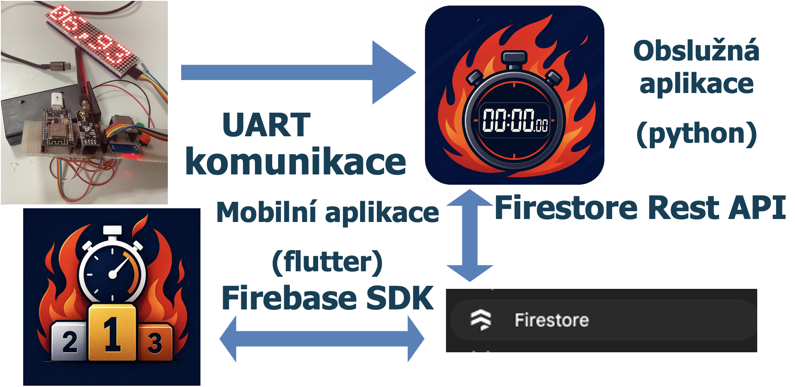

**Legend (Czech text in image):**
- **UART komunikace** = UART Communication (serial connection to stopwatch)
- **Obslužná aplikace (python)** = Desktop Application (Python) - Race management and timing control
- **Mobilní aplikace (flutter)** = Mobile Application (Flutter) - Public leaderboard display

**Data Flow:** Electronic Stopwatch → Python App (UART) → Firebase → Flutter App (Web/Mobile)

---

## ✨ Features

### Python Desktop Application

- 🔐 **Secure Access Control**
  - Role-based authentication (Super Admin, Admin, Writer, User)
  - Email/password login system
  - Protected Firestore database with role-based rules
  
- 📊 **Race Management**
  - 5 dedicated management pages with role-based visibility
  - Stopwatch integration for precise timing
  - Real-time race data synchronization
  - Sport-specific presets and configurations

- 🎨 **User Interface**
  - Dark-blue theme (customizable)
  - Responsive design
  - Multi-language support (English, Czech) + own translations

### Flutter Leaderboard Application

- 🏆 **Leaderboard Display**
  - Real-time race standings
  - Multiple race and league support
  - Team and individual rankings

- 🔔 **Push Notifications**
  - League-level master notifications
  - Per-race notifications
  - Firebase Cloud Messaging integration using tokens

- 🌍 **Multi-Platform**
  - Web browser access (no installation required)
  - iOS mobile app
  - Android mobile app
  - No authentication required (public access)

- ⚙️ **Customization**
  - Dynamic language selection (download translation files given by super admin)
  - Configurable color themes (black/white background with colored accents)
  - Flexible team list views (Starting list or leaderboard sort)

- 📱 **Three Main Screens**
  1. **Welcome Screen**: Browse leagues and races with notification bell controls
  2. **Home Screen**: Detailed leaderboard data for selected race with team list switching
  3. **Settings Screen**: Language selection, theme customization, and translation management

---

## 📊 Feature Comparison

| Feature | Python App | Flutter App |
|---------|-----------|-------------|
| **Race Management** | ✅ Full control | ❌ View only |
| **Timing Control** | ✅ Stopwatch integration | ❌ N/A |
| **Authentication** | ✅ Required (role-based) | ❌ Public access |
| **Leaderboard Display** | ✅ Internal view | ✅ Real-time public display |
| **Cross-Platform** | ❌ macOS only (for now) | ✅ Web, iOS, Android |
| **User Management** | ✅ Super Admin only | ❌ N/A |
| **Notifications** | ❌ No | ✅ Push notifications + toasts |
| **Installation** | ✅ .app bundle | ✅ No installation (web) |

---

## 🎨 Screenshots

> **Note on Languages**: The screenshots below include Czech text to demonstrate the multi-language integration (English and Czech translations). If desired, we can retake these screenshots with full English text in the future.

### Python Desktop Application

**Login & Dashboard**

The application starts with a secure login screen and provides role-based dashboard access for race management.

| | |
|---|---|
| 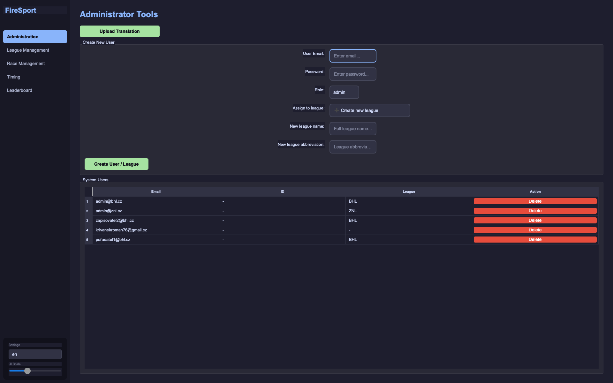 | 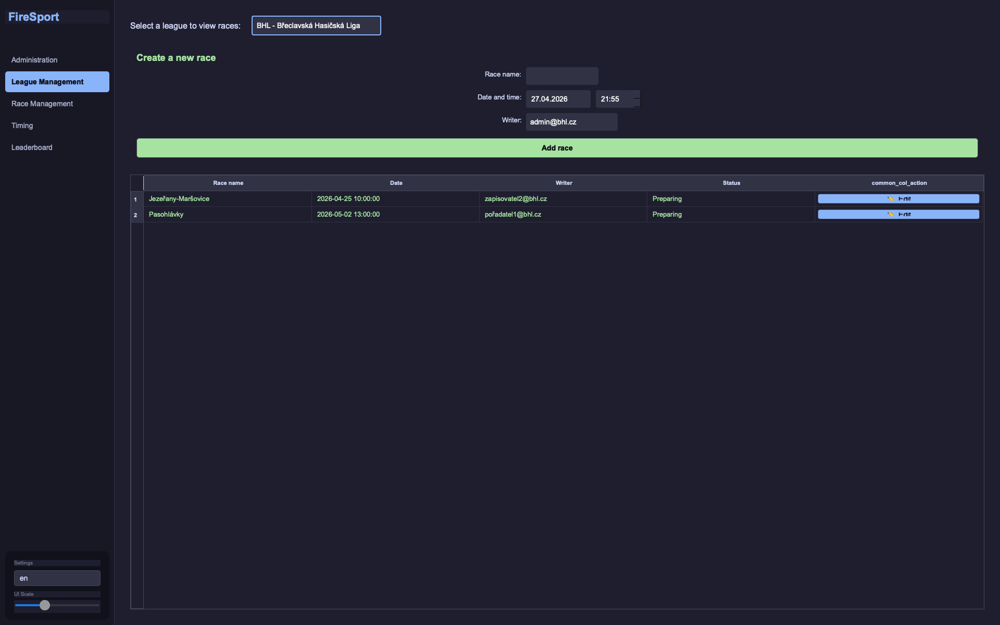 |

**Race Management**

Manage race schedules and timing information with intuitive forms and controls.

| | |
|---|---|
| 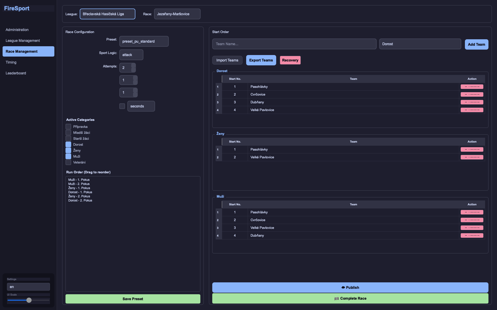 | 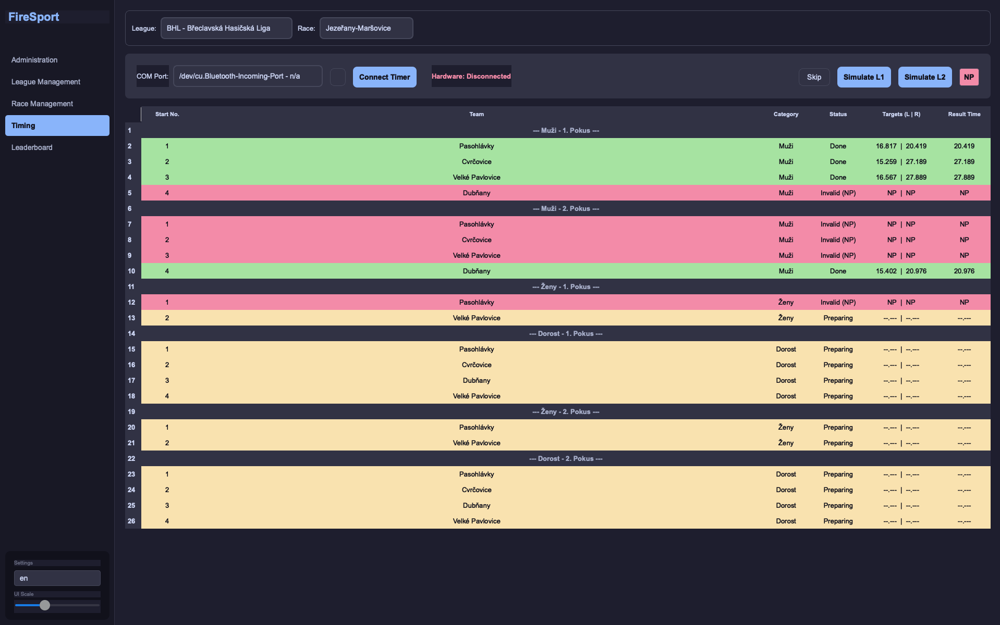 |

**Leaderboard Views**

Real-time leaderboard display with multiple filtering options - view by category, starting positions, or final standings.

| | | |
|---|---|---|
| 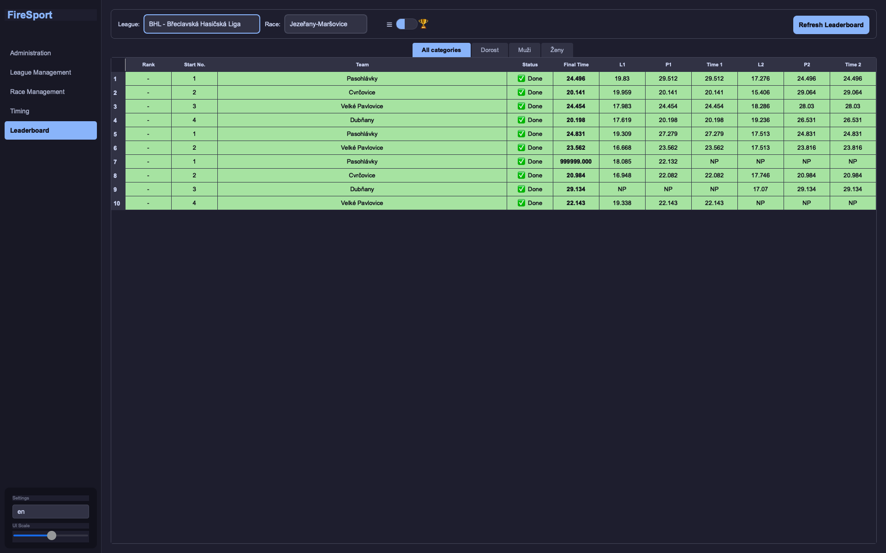 | 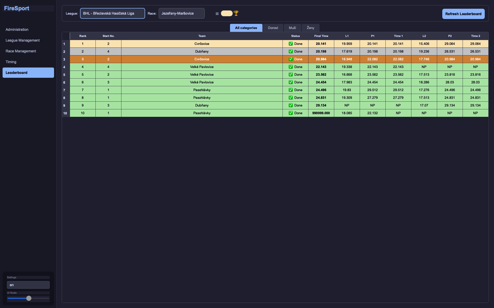 | 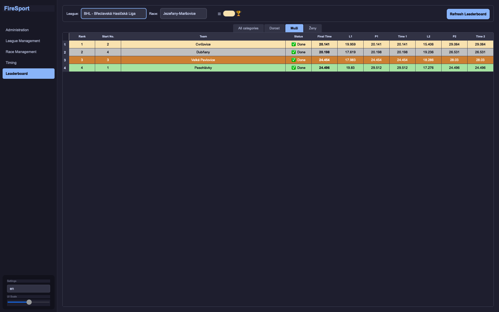 |

### Flutter Leaderboard Application

**League & Race Selection**

Browse available leagues and select races to view their leaderboards. Get notifications about race updates.

| | | |
|---|---|---|
| 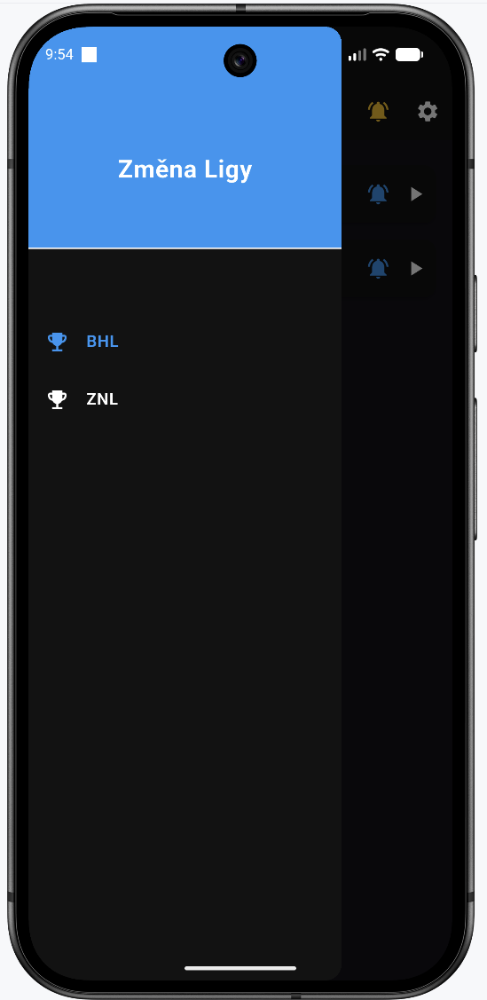 | 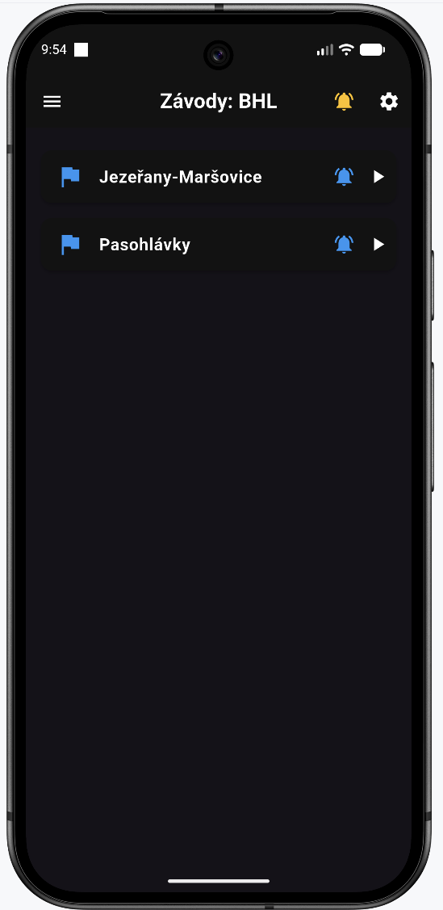 | 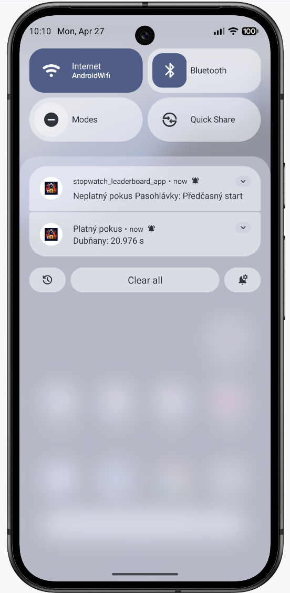 |

**Leaderboard Display**

View real-time leaderboards in multiple layouts with responsive design that adapts to landscape orientation.

| | | |
|---|---|---|
| 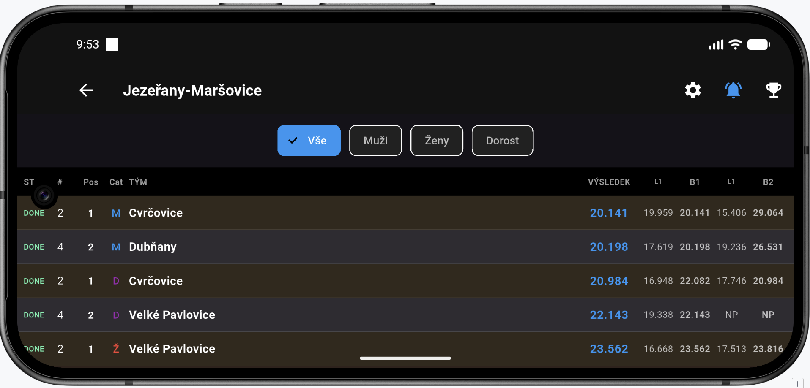 | 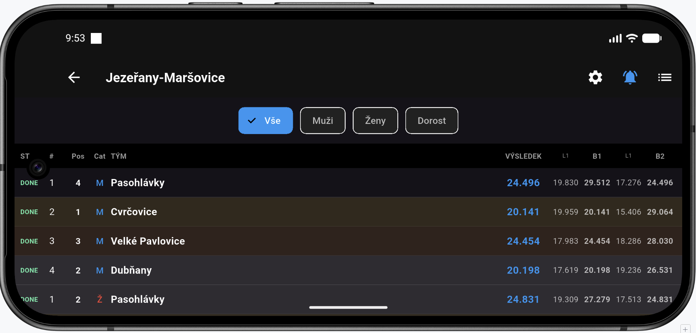 | 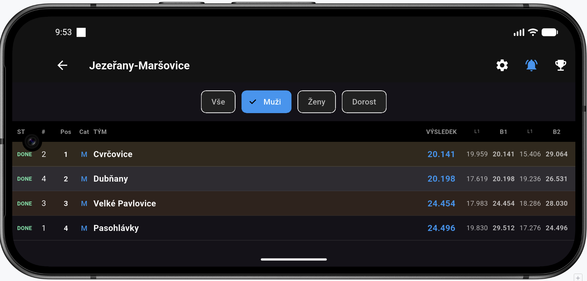 |

**Settings & Customization**

Customize the app theme, select your preferred language, and manage notifications.

| | |
|---|---|
| 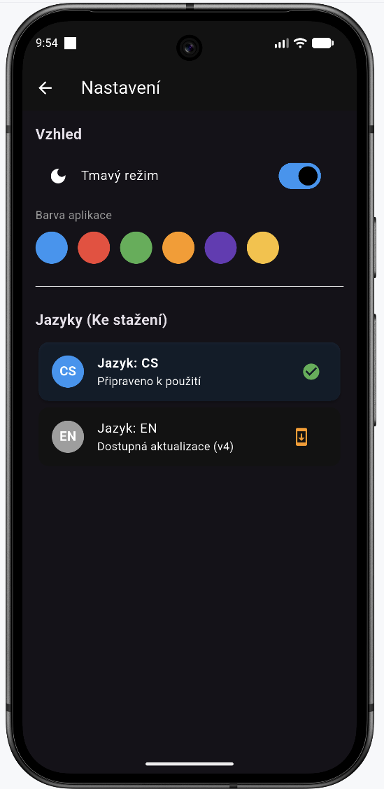 | 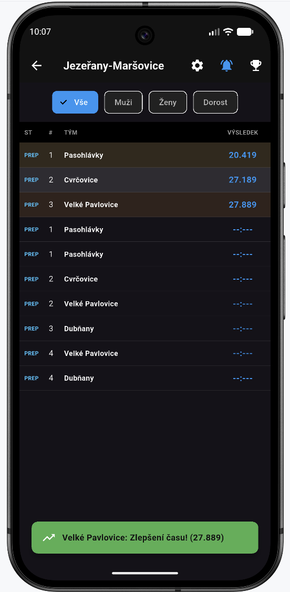 |

---

## �📁 Project Structure

```
Leaderboard_Application/
├── Python GUI Application (Desktop)
│   ├── main.py                          # Entry point
│   ├── core/
│   │   ├── config_manager.py            # File paths configuration
│   │   ├── firebase_service.py          # Firebase integration
│   │   ├── sport_logic.py               # Sport-specific business logic
│   │   └── translate.py                 # Translation system
│   ├── GUI_windows/                     # 3 windows + 5 management pages
│   │   ├── login.py
│   │   ├── dashboard.py                 # main window (cross-walk between pages)
│   │   ├── race_page.py
│   │   ├── league_page.py
│   │   ├── timing_page.py
│   │   ├── leaderboard_page.py
│   │   ├── admin_tools.py
│   │   └── confirm.py
│   ├── themes/                          # Application themes
│   │   └── dark-blue.qss               # Dark blue theme stylesheet
│   ├── lang/                            # Language files
│   │   ├── en.json                      # English
│   │   ├── cs.json                      # Czech
│   │   └── fr.json                      # French (empty for now)
│   ├── requirements.txt                 # Python dependencies
│   ├── settings.json                    # User preferences (runtime)
│   ├── firebase-config.json             # Firebase credentials (NOT COMMITED)
│   ├── sport_presets.json               # Sport configurations
│   ├── categories.json                  # Category definitions
│   ├── img/                             # GUI screenshots & documentation images
│   └── build.spec                       # PyInstaller configuration
│
├── Flutter Leaderboard Application (Web/Mobile)
│   └── stopwatch_leaderboard_app/
│       ├── lib/
│       │   ├── main.dart                # Entry point
│       │   ├── welcome_screen.dart      # League & race browser
│       │   ├── home_screen.dart         # Leaderboard display
│       │   ├── settings_screen.dart     # Settings & customization
│       │   ├── team_model.dart          # Team data model
│       │   ├── firebase_service.dart    # Firebase integration
│       │   ├── firebase_options.dart    # Firebase configuration
│       │   ├── theme_provider.dart      # Theme management
│       │   └── cs.json & en.json        # Language files
│       ├── android/                     # Android native configuration
│       ├── ios/                         # iOS native configuration
│       ├── web/                         # Web platform configuration
│       ├── assets/                      # App icons & resources
│       ├── pubspec.yaml                 # Flutter dependencies
│       ├── firebase.json                # Firebase configuration
│       └── README.md                    # Flutter app documentation
│
├── Cloud Functions
│   └── functions/
│       ├── main.py                      # Cloud function logic (for FCM)
│       └── requirements.txt             # Function dependencies
│
└── Documentation
    ├── README.md                        # This file
    ├── BUILD_GUIDE.md                   # Python app build guide
    └── recovery_start_list.json         # Recovery data
```

---

## 🖥️ System Requirements

### Python Application
- **OS**: macOS 10.14+
- **Python**: 3.9 or higher
- **Memory**: 4GB RAM minimum
- **Storage**: 500MB available space

### Flutter Application
- **Web**: Any modern web browser (Chrome, Safari, Edge)
- **iOS**: iOS 13.0+
- **Android**: Android 5.0+ (API level 21+)

### General Requirements
- **Firebase Project**: Active Firebase project with Firestore database
- **Internet Connection**: Required for all features
- **Device Compatibility**: 
  - Stopwatch devices (USB connected for Python app like in [Related Projects](#related-projects)) 
  - Network connectivity for Firebase sync

---

## 💾 Installation

### Prerequisites

1. **Clone the Repository**
   ```bash
   git clone https://github.com/krivanekroman76/Leaderboard_Application
   cd Leaderboard_Application
   ```

2. **Firebase Setup**
   - Create a Firebase project at [firebase.google.com](https://firebase.google.com)
   - Enable Firestore Database
   - Enable Cloud Messaging (for functions you need to upgrade to blaze)
   - Create service account key and download JSON
   - Create authentication users with appropriate roles (1. super admin)

### Python Application Setup

1. **Create Virtual Environment**
   ```bash
   python3 -m venv .venv
   source .venv/bin/activate  # On Windows: .venv\Scripts\activate
   ```

2. **Install Dependencies**
   ```bash
   pip install -r requirements.txt
   ```

2. **Configure Firebase**
   - Copy your Firebase configuration to `firebase-config.json` in the project root
   - Never commit this file (add to .gitignore)

3. **Configure Application**
   - Edit `settings.json` with your preferences
   - Edit `sport_presets.json` for your sports configuration
   - Edit `categories.json` for event categories

### Flutter Application Setup

1. **Install Flutter**
   ```bash
   # Follow https://flutter.dev/docs/get-started/install
   flutter --version  # Verify installation
   ```

2. **Configure Firebase**
   ```bash
   cd stopwatch_leaderboard_app
   flutterfire configure
   ```

3. **Get Dependencies**
   ```bash
   flutter pub get
   ```

---

## 🚀 Usage

### Running the Python Application

**Development Mode:**
```bash
python3 main.py
```

**First Launch:**
- Login screen appears with email/password fields
- Contact your Super Admin to create user accounts
- Roles and permissions will determine visible pages

### Running the Flutter Application

**Web (Development):**
```bash
cd stopwatch_leaderboard_app
flutter run -d web
```

**Android (Development):**
```bash
cd stopwatch_leaderboard_app
flutter run -d android
```

**iOS (Development):**
```bash
cd stopwatch_leaderboard_app
flutter run -d ios
```

**Mobile Device Deployment:**
- Follow Flutter's [deployment guides](https://flutter.dev/docs/deployment)
- Android: Build APK/AAB for distribution
- iOS: Deploy via TestFlight or App Store
- Web: Deploy to hosting service (Firebase Hosting recommended)

### Application Workflow

**Race Event Setup:**
1. Super Admin logs in and configures leagues and users
2. Admins and Writers manage races and timing
3. Users view leaderboard via Python app
4. Public viewers access Flutter app for real-time leaderboard

**Leaderboard Access:**
1. Open Flutter app (web URL or mobile app)
2. Select league on Welcome Screen
3. Select specific race
4. View real-time leaderboard on Home Screen
5. Optional: Enable notifications with bell icon (than notification on closed screen)

---

## ⚙️ Configuration

### Python Application Configuration

**settings.json** (User Preferences)
```json
{
    "theme": "dark-blue",
    "remember_email": false,
    "saved_email": "",
    "lang": "cs"
}
```

**firebase-config.json** (Firebase Credentials - DO NOT COMMIT)
```json
{
    "apiKey": "YOUR_API_KEY",
    "projectId": "YOUR_PROJECT_ID",
    "storageBucket": "YOUR_STORAGE_BUCKET"
}
```

**sport_presets.json** (Sport Configuration)
- Define sport-specific timing rules
- Configure distance and course parameters
- Customizable for different event types

**categories.json** (Event Categories)
- Define race categories (age groups, skill levels, etc.)
- Customize for your event needs 

### Flutter Application Configuration

**Theme Customization** (Settings Screen)
- **Background**: Black or White
- **Accent Colors**: Customizable button and switch colors
- Preferences saved locally via SharedPreferences

**Language Selection** (Settings Screen)
- Download translation JSON files
- Available languages: English, Czech (extensible by super admin)
- Add new languages by creating new `.json` translation files

**Firebase Settings** (firebase_options.dart)
- Auto-configured by `flutterfire configure`
- Project ID, API keys, and messaging configuration

---

## 🔨 Building & Deployment

### Python Application Deployment

**Step 1: Prepare Configuration Files**

Before building, ensure these files exist in the project root. The build script will automatically bundle them inside the .app:

- **firebase-config.json** - Firebase credentials (create if missing)
  ```json
  {
      "apiKey": "YOUR_API_KEY",
      "projectId": "YOUR_PROJECT_ID",
      "storageBucket": "YOUR_STORAGE_BUCKET"
  }
  ```

- **settings.json** - User preferences (create if missing)
  ```json
  {
      "theme": "dark-blue",
      "remember_email": false,
      "saved_email": "",
      "lang": "cs"
  }
  ```

- **sport_presets.json** - Sport configurations (required, should already exist)
- **categories.json** - Category definitions (required, should already exist)
- **lang/** - Language files directory (required, should contain en.json, cs.json, etc.)

**Step 2: Build the .app Bundle**

Run the automated build script:
```bash
./build.sh
```

This will:
- ✅ Check PyInstaller and dependencies
- ✅ Create `dist/StopwatchControl.app`
- ✅ **Automatically copy all config files inside the .app bundle**
- ✅ **Automatically copy lang/ and themes/ directories inside the .app**
- ✅ Verify the build was successful

> **Note:** Files are bundled inside the .app bundle, making it completely self-contained. If any config files don't exist, they will be skipped (with a note in the output) - you should create them in the project root before building.

**Step 3: Test**

```bash
# Test the built app
open dist/StopwatchControl.app
```

**ConfigManager Behavior:**

The app uses ConfigManager to intelligently locate resources:
- **First**: Looks inside the .app bundle (Contents/Resources/) for bundled assets
- **Second**: Looks next to the .app for user overrides
- **Fallback**: Uses development directory paths

This means:
- ✅ Users can place an updated `settings.json` next to the .app to override bundled settings
- ✅ Users can place new translation files next to the .app
- ✅ Firebase credentials can be updated by placing a new config file next to the .app

Best approach is to open .app using right click and edit the files inside

For detailed build troubleshooting, see [BUILD_GUIDE.md](BUILD_GUIDE.md).

### Flutter Application Deployment

**Web Deployment:**
```bash
cd stopwatch_leaderboard_app
flutter build web --release
# Host the website by Firebase hosting (free) (needs hosting in firebase.json)
firebase deploy --only hosting
# Or deploy the 'build/web' folder to your hosting service
```

**Android Deployment:**
```bash
cd stopwatch_leaderboard_app
flutter build apk --release  # APK file
# or
flutter build appbundle --release  # For Play Store
```

**iOS Deployment:**
```bash
cd stopwatch_leaderboard_app
flutter build ios --release
# Follow Xcode instructions for App Store deployment
```

---

## 🌐 Supported Languages

The application currently supports:
- **English** (en.json)
- **Czech** (cs.json)

To add a new language:
1. Create new translation file in `lang/`
2. Follow existing JSON format

For Flutter **super admin** needs to publish new language into firestore using `publish` button, example .json is in **stopwatch_leaderboard_app** directory.

---

## 🔐 Security Considerations

### Authentication
- Email/password authentication for Python app
- Role-based access control (Super Admin, Admin, Writer, User)
- Firebase Firestore security rules enforce role-based permissions

### Data Protection
- Never commit `firebase-config.json`
- Use environment variables for production deployment
- Firestore rules prevent unauthorized data access
- Flutter app has read-only access to public race data

### Best Practices
- Regularly update dependencies
- Review Firestore security rules
- Use strong passwords for user accounts
- Keep Firebase credentials secure
- Monitor user access and permissions

---

## 📝 License

This project is licensed under the **MIT License** - see the [LICENSE](LICENSE) file in the repository root for details.

The MIT License allows you to freely use, modify, and distribute this software, provided you include the original license notice.

---

## 🔗 Related Projects

- **FireSport Stopwatch - Wireless**: [github.com/krivanekroman76/FireSport_Stopwatch-Wireless](https://github.com/krivanekroman76/FireSport_Stopwatch-Wireless) - Electronic stopwatch firmware for wireless integration

---

## 📧 Support & Contact

For issues, questions, or contributions, please contact the development team.

---

## 📋 Future Improvements (TODO)

The following features and sections are planned for future releases:

- [ ] **Troubleshooting Section** - Common Firebase errors, Flutter build issues, and Python dependency problems with solutions
- [ ] **Contributing Guidelines** - How to report issues, submit pull requests, and code style guidelines
- [ ] **FAQ Section** - Frequently asked questions (Firebase requirements, language support, concurrent user limits)
- [ ] **Demo/Video Links** - Live demo URL for Flutter web version and walkthrough videos
- [ ] **Requirements Checklist** - Clear breakdown of what's included vs. what users need to set up
- [ ] **Admin Setup Guide** - Step-by-step guide for Super Admins to configure the system for the first time
- [ ] **API Documentation** - For developers extending the application
- [ ] **Internationalization Examples** - How to add more languages beyond English/Czech
- [ ] **Fix minor bugs** like NP toasts
---

**Last Updated**: April 27, 2026

